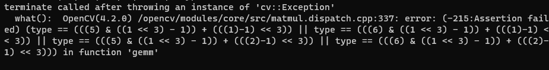

# ERRORS AND SOLVES

container not starting (no error message, returns to terminal)
**SOLVE** : docker desktop is probably swithced off, switch it on
  

error while loading shared libraries: libopencv_gapi.so.4.2: cannot open shared object file: No such file or directory.

**SOLVE** : although no indication, installing boost solves the problem (dependency issue): apt-get install -y scons libboost-all-dev  

  
  

 the huge assert  expression evaluates to : <code>( type == 5 || type == 6 || type == 13 || type == 14 ).</code>

 all the <code>&</code>s and <code>>></code>'s and are <a href="https://www.geeksforgeeks.org/bitwise-operators-in-c-cpp/"> bitwise operations.</a>

 reffering back to 
