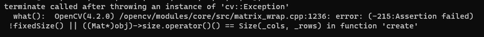

# ERRORS AND SOLVES

<details>
<summary>container not starting (no error message, returns to terminal)</summary>**SOLVE** : docker desktop is probably swithced off, switch it on
<br> 
</details>


<details><summary>error while loading shared libraries: libopencv_gapi.so.4.2: cannot open shared object file: No such file or directory.</summary>
**SOLVE** : although no indication, installing boost solves the problem (dependency issue): apt-get install -y libboost-all-dev  </details>

<details><summary>


  
  </summary>

 the huge assert  expression evaluates to : <code>( type == 5 || type == 6 || type == 13 || type == 14 ).</code>

 all the <code>&</code>s and <code>>></code>'s and are <a href="https://www.geeksforgeeks.org/bitwise-operators-in-c-cpp/"> bitwise operations.</a>

 reffering back to <a href="https://gist.github.com/yangcha/38f2fa630e223a8546f9b48ebbb3e61a"> cv::Mat types </a> , and mapping the values 5, 6, 13, 14, we can see the types which are supported for the operation that gave the error. : i.e.

 | | C1 | C2 | C3 | C4
|---|---|---|---|---|
|CV_8U|	0|	8|	16|	24
|CV_8S|	1|	9|	17|	25
|CV_16U| 2|	10|	18|	26
|CV_16S| 3|	11|	19|	27
|CV_32S| 4|	12|	20|	28
|CV_32F| 5|	13|	21|	29
|CV_64F| 6|	14|	22|	30

according to the table, the operations are supported only for 1 channel and 2 channel operations for Floats, since matrices are 3 channels, we cant do a lot of such operations for image matrices directly, We will have to do it channel wise.
</details>

<details><summary> shape mismatch errors. variations of : 


</summary>

The Definition of a Mat <code>Mat testmat = Mat(1, 5, CV_32FC1, Scalar(2));</code> is done as (rows, columns, type, value), but the <code>Mat.size()</code> function returns dims as [columns x rows], which causes a lot of confusion. check how the shape of the matrices look when they are multiplied, in the below image. 

Try all possible combinations if youre bugged out, i.e a.t x b, a x b.t , a x b , a.t x b.t , and similarly for b'' first and 'a' second 

</details>
<details><summary> dim mismatch while slice-assigning arrays.


</summary>

It is due to mentioning the dimentions dont allign , when trying to make assignments to matrices with other matrices
```cpp
cout << "\n\n\n" << procChannels[ch].size() << " " << procChannels[ch].type() << "  .copyTo( " << outChannels[ch](roi).size() << " " << outChannels[ch](roi).type();
    procChannels[ch].copyTo(outChannels[ch](roi));
```

</details>

<details>
<summary>undefined reference to `euclideanDistance(cv::Mat&, cv::Mat&)' (some function or class or whatever)
collect2: error: ld returned 1 exit status<br>

</summary>
<br>
You probably didnt add the relavent complimentary cpp files for compiation in the ''' g++ ... ''' command in the Makefile. <b> If you are using the function from some other cpp file, add those files as well in g++ command in the makefile</b>
<br>
</details>

- using CV_16F with pow gives segmentation fault, CV_16F dosent exist, chatgpt used it, beware.

<details>
<summary> <b>Undefinened reference </b>to (some template related stuff function/class) </summary>
<br>
<b> ALL TEMPLATE CLASSES/FUNCTIONS MUST BE DEFINED IN THE HEADER </b><br>
refer this <a href="https://isocpp.org/wiki/faq/templates#templates-defn-vs-decl"> template functions/classes declaration/definition in headers.</a>
</details>

- squareroot of -ve values gives -nan 

<details>
<summary> Not an ERROR but, unexpected behaviour, read docs. <br> intialize 64F mats with double arrays, and 32F mats with float arrays</summary>

```cpp
float a[5] = {1, 1,  1, 1, 1};
double b[5] = {3, 2, 0, 4, 8};

cv::Mat temp1 = cv::Mat(1, 5, CV_32FC1, a);
cv::Mat temp2 = cv::Mat(1, 5, CV_64FC1, a);
cv::Mat temp3 = cv::Mat(1, 5, CV_32FC1, b);
cv::Mat temp4 = cv::Mat(1, 5, CV_64FC1, b);

std::cout << "\ntemp 1 :\t";
printmat(temp1, 8);
std::cout << "\ntemp 2 :\t";
printmat(temp2, 8);
std::cout << "\ntemp 3 :\t";
printmat(temp3, 8);
std::cout << "\ntemp 4 :\t";
printmat(temp4, 8);
```


</details>