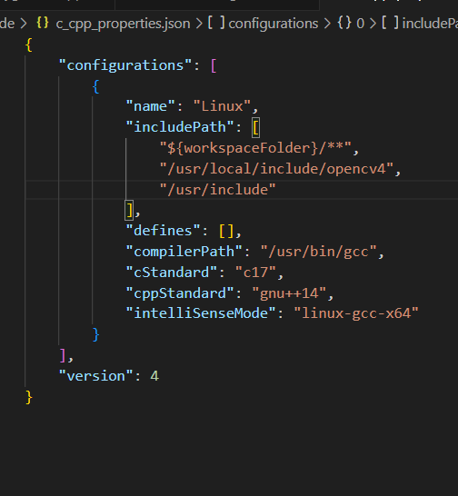
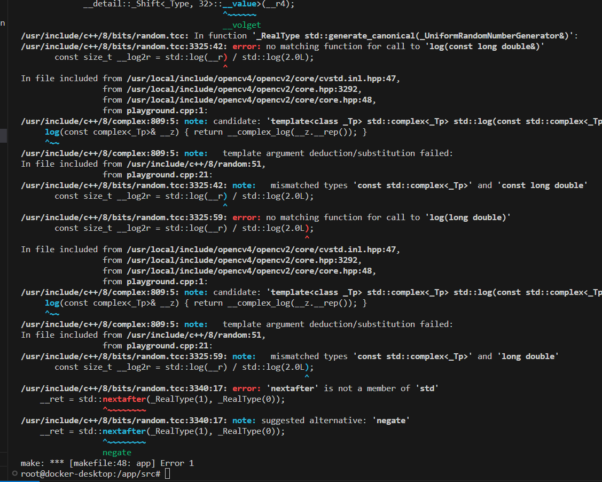

# General C++ notes

<details>
    <summary>
        Using a function(function pointer) as a member variable :
    </summary>
    
    You have a class implementing some pipeline, that may take one of many preprocessing functions to be part of its pipeline, based on the user's choice. 

    if all the options are included in the class definition, The class definition becomes unreadable. 

    i.e in reference to the Single responsibility principle of SOLID.

    example : 

```cpp
class pipeline{

    /*defining the function pointer of the signature of a preprocessor
    i.e A preprocessor that takes 2 integers and returns 1 integer.*/
    typedef int (*preprocessorMethod)(int, int);

    int a, b;
    char* csvOutPath[256];
    preprocessorMethod processor;

    public:
        featureExtractor( preprocessorMethod processor ){
            a = 2;
            b = 3;
            this->processor = processor; 
        }

        int getval(){
            int c = processor(a,b);
            return c; 
        }
};

int add(int a, int b){
    return a+b;
}

int subtract(int a, int b){
    return a-b;
}


int main(int argc, char *argv[]) {

    pipeline testpipeline{subtract};

    int a = testfptr.getval();

    std::cout<< "\n function poineter a parameter test : " << a;

    return(0);
}
```

</details>

<details>
    <summary>
    defining reusable classes in headers ('.h' files).
    </summary>
Most often, classes are defined in header files of the same name as the class, and any member functions defined outside of the class are put in a . cpp file of the same name as the class  

<a href="https://www.learncpp.com/cpp-tutorial/classes-and-header-files/">learncpp discusses this</a>
</details>

<details>
    <summary>
    path not found (package not found) (vscode)
    </summary>

- check in <code>/usr/include</code> or <code>/usr/local/</code>
- if you cant find it, uninstall, reinstall, and look install/build logs for the exact package name / path to the package.
- once you find the package do a <code>dpkg -L '''package path'''</code>
- you can find a director where this particular package, and possibly other packages will be there. Add the inner most common directory to  <code>c_cpp_properties.json</code>
 

</details>

<details>
<summary>
DO NOT LEAVE HEADERS BLANK. you will get Crazy linkage errors in inbuilt packages.
</summary>


</details>