# opencv notes:

<details>
<summary style="font-size:2.35vw"> <b>cv::Mat : background, slicing, display : </b></summary>
reference : <a href="https://docs.opencv.org/4.x/d6/d6d/tutorial_mat_the_basic_image_container.html">cv::Mat tutorial docs</a> 

1. Mat is the object used for storing images as arrays.

2. cv::MAT object consists of a header containing matrix details like matrix dimention details, storing method, pixel value array address.

3. using the copy constructor () / list intialization {} / assigment = will only copy header. i.e. in the below code, all 3 objects A, B, C point to the same pixel matrix. 

```cpp
Mat A, C;
A = imread(argv[1], IMREAD_COLOR); 
Mat B(A); 
C = A;
```

4. to make a copy of the pixel value matrix , shoude use <code> cv::Mat::clone() </code> <code> cv::Mat::copyTo() </code>

```cpp
Mat F = A.clone();
Mat G;
A.copyTo(G);
```


5. to **slice** Mat

```cpp
Mat frame;
*inputVideo >> frame;
Mat slice{frame(Range(140,145) , Range(140,145))};
```
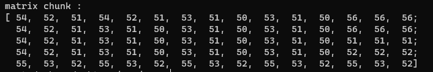
(c*ch) * r ?


6. Mat with random values <code>cv::randu()</code>

```cpp
Mat R = Mat(3, 2, CV_8UC3);
randu(R, Scalar::all(0), Scalar::all(255));
```

7. formatting Mat dislay in cout :  <code>format(mat_name, Formatter::FMT_PYTHON)</code>

```cpp
Mat slice{frame(Range(140,145) , Range(140,145))};
cout << "\nmatrix chunk : \n" << format(slice Formatter::FMT_NUMPY ) <<"\n";
```
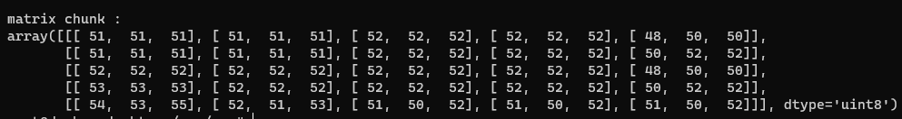
</details>


<details>
<summary style="font-size:2.35vw"> <b>color spaces and applications : </b></summary>

reference : <a href="https://docs.opencv.org/4.x/d6/d6d/tutorial_mat_the_basic_image_container.html">cv::Mat tutorial docs</a> 

- ***RGB*** is the most common as our eyes use something similar, however keep in mind that OpenCV standard display system composes colors using the BGR color space (red and blue channels are swapped places).
- The ***HSV*** and ***HLS*** decompose colors into their hue, saturation and value/luminance components, which is a more natural way for us to describe colors. You might, for example, dismiss the last component, making your algorithm less sensible to the light conditions of the input image.
- ***YCrCb*** is used by the popular JPEG image format.
- ***CIE L\*a\*b\**** is a perceptually uniform color space, which comes in handy if you need to measure the distance of a given color to another color.

</details>

<details>
<summary style="font-size:2.35vw"> <b>setting up IP CAM from integrated web-cam : to use webcam with opencv c++ in a docker image hosted on WSL</b></summary>
reference : <a href="https://www.youtube.com/watch?v=zd012EHvsIg">ip cam using VLC media player</a>

1. open vlc media player
2. goto media -> stream
3. goto capture device tab and select video device name, and audio device name.
4. click "advanced options" button in the same step and "tick" the device properties checkbox
5. click on the scroll down attached to the "stream" button, and click "stream"

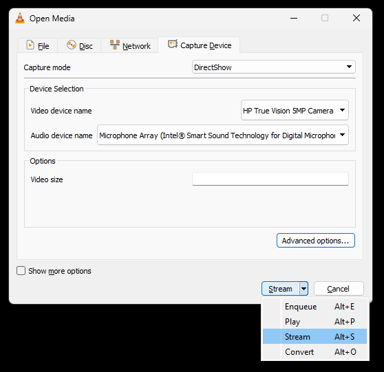
6. at the source setting window, click next.
7. open the file scroll down and click **http** (change 1), 
8. click add, and type in the some name (referred to as \<some name\> from now on.), this will be part of the url.

 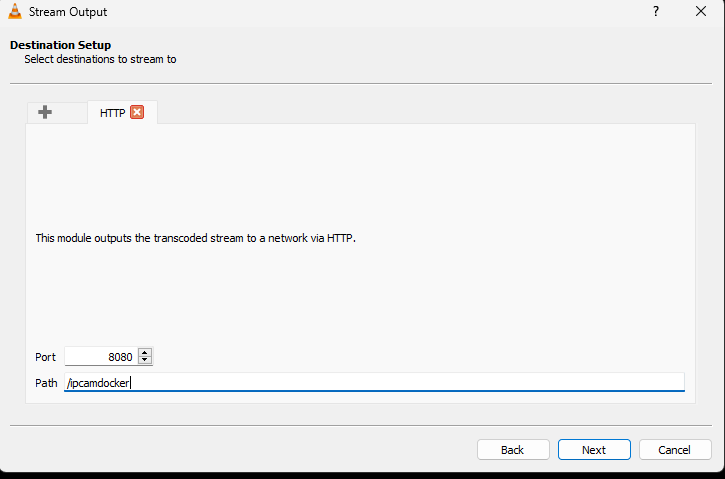

9. select "video - H.264 + MP3 (MP4)" 

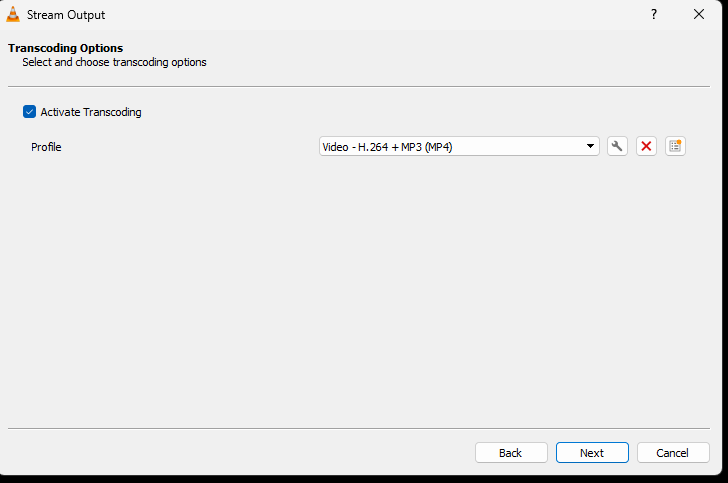

10. select **MP4/MOV** change(2)

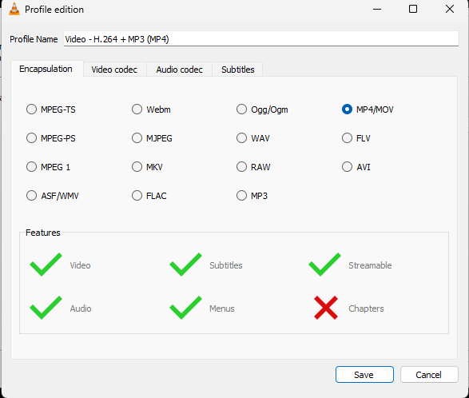

11. click the "spanner" icon next to the previously set dropdown, go to each of the tabs in the configuration window, and apply settings as below : 

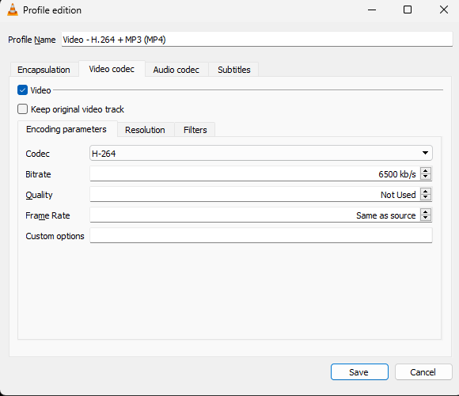

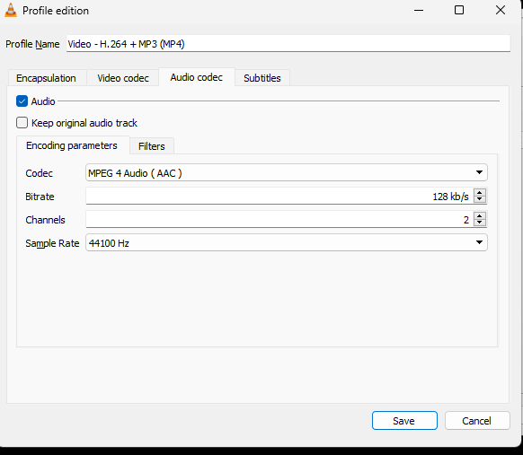

nothing needed for subtitles , because we dont have any

12. click save, and next

13. from the generated output string, copy the highlighted part. This part will be part of the stream's URL

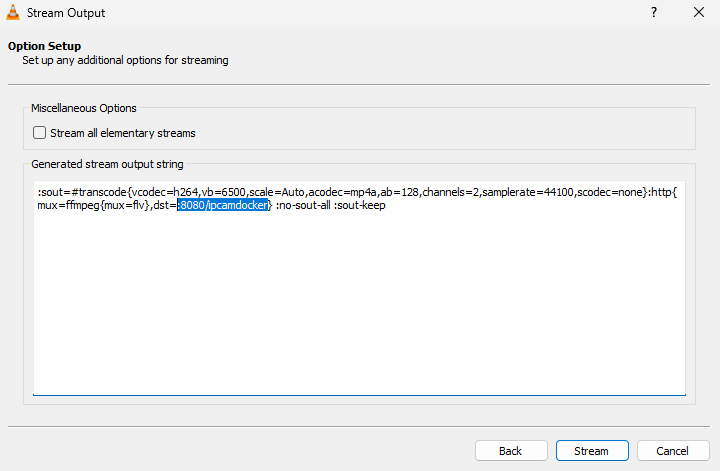

14. click stream

15. a new window wil openup with video properties, click default, in both "Video Proc Amp" tab, and "Camera Control" tab.

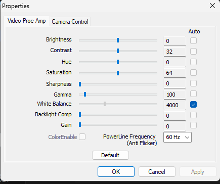

16. click next / apply + ok

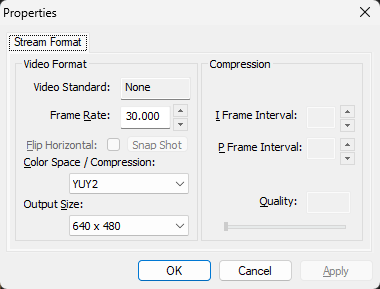

17. click apply + OK

17. the audio properties tab will open, click apply + OK in this tab as well.

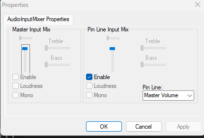

18. check the vlc media player's window. the stream should have started :

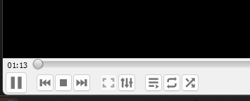


19. find your ip address using the "ipconfig /all" command in cmd

20. search for this part of the output, and look under **IPv4 Address** for your IP address, which will be in the following format : xx.xxx.xxx.xx

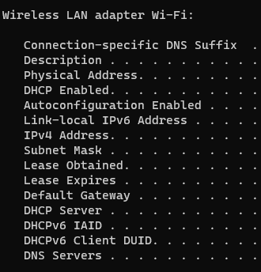

21. your final ip camera url will be "http://\<ip address\>:8080/\<some name\>", (reffer previous steps for what \<some name\> is.)

22. Now you can do add use the below lines of code and have a valid object that returns frames from the ip camera, in your docker container.

```cpp
string vidPath = "http://<ip address>:8080/<some name>";
inputVideo = new VideoCapture(vidPath);
```
</details>